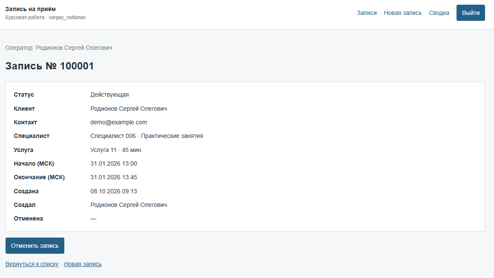
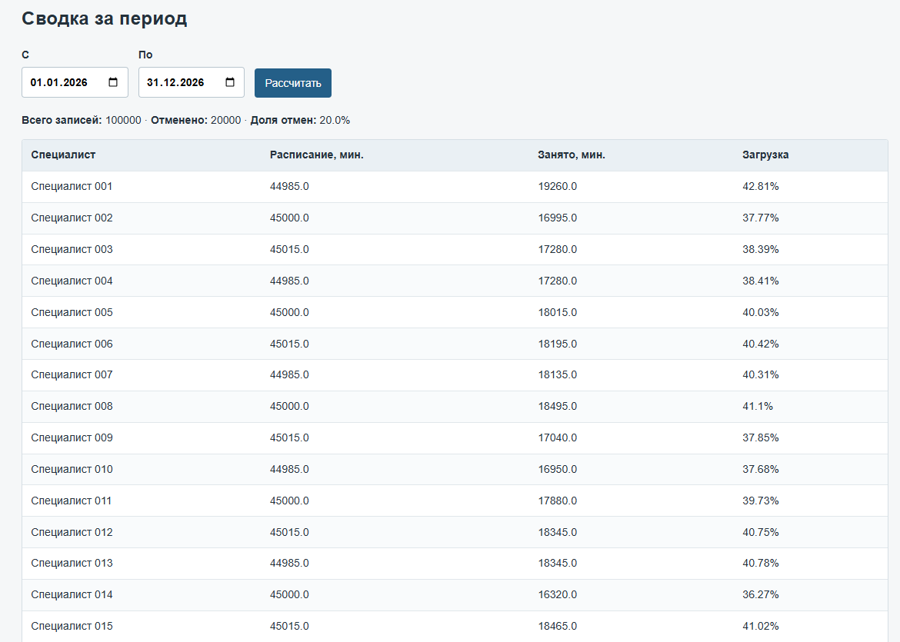
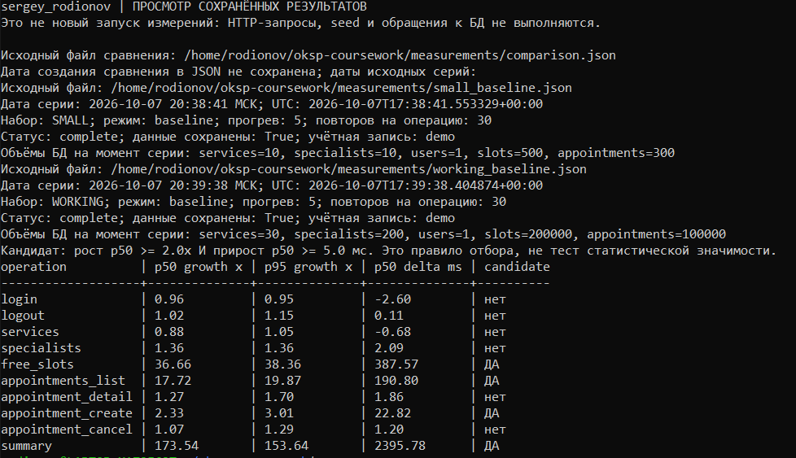

# ДЗ1 — содержательный текст окончательного отчёта

Родионов Сергей Олегович, БИСТ-24-ПО-2.
Оформленная версия: [DOCX](ДЗ1_Родионов_Сергей_отчёт.docx).

## ЗАДАНИЕ И ВАРИАНТ

Таблица 1 – Вариант и стенд

| Параметр | Значение |
| --- | --- |
| Студент / группа | Родионов Сергей Олегович / БИСТ-24-ПО-2 |
| Вариант и предметная область | 3 — запись на приём к специалисту (Р входит в Н–Я) |
| Личный префикс | sergey_rodionov: БД, схема и проект Compose |
| Сервер | Python 3.12.12; FastAPI 0.115.12; Uvicorn 0.34.2 |
| Доступ к данным | SQLAlchemy 2.0.40; psycopg 3.2.6 |
| СУБД | PostgreSQL 16.10 |
| Клиент и тесты | Jinja2 3.1.6, HTML/CSS, JavaScript; pytest 8.3.5 |
| Репозиторий | https://github.com/SergeySRE/oksp_dz1_RodionovSO |

Сервис хранит расписание специалистов слотами и позволяет оператору записать клиента на выбранную услугу. Создание отклоняется, если слот занят, приём пересекается с действующей записью или длительность не соответствует услуге. Отмена сохраняет историю и возвращает слот в свободные. Сводка показывает загрузку специалистов и долю отмен за период.

## ВВЕДЕНИЕ

Исходные измерения показывают время операций до оптимизации и его изменение при росте данных. Они дают числовую основу для последующего поиска узких мест.

Цель работы — реализовать сервис варианта 3 и получить воспроизводимые исходные показатели его производительности.

Для достижения цели необходимо решить следующие задачи:

1. Реализовать сервис, авторизацию и обязательные экраны.

2. Описать структуру данных и контракт API.

3. Покрыть правила и операции тестами.

4. Создать воспроизводимые наполнения SMALL и WORKING.

5. Измерить время всех операций на обоих объёмах и сравнить результаты.

6. Разложить время выбранных операций на SQL и остаток.

7. Сформулировать численно обоснованные гипотезы узких мест.

8. Проверить очевидные ошибки и оформить результаты.

## 1 Сервис, стенд и данные

### 1.1 Сервис и контракт

Пять таблиц связаны внешними ключами: slots относится к specialists и services, appointments — к slots и создавшему запись users; каждому специалисту, услуге, слоту и пользователю может соответствовать несколько связанных строк.

На момент измерений были только пять PK-индексов; кеширование данных, очереди, фоновая обработка и хранение пользовательских файлов вне БД в сервисе не применялись.

Оператор ищет свободный слот, создаёт и отменяет запись клиента. Интерфейс содержит список с фильтрами и пагинацией, карточку со связанными сущностями, сводку и форму записи. Вход demo/demo использует подписанную cookie-сессию (HttpOnly, SameSite=Lax); сервер — FastAPI, страницы — Jinja2.

Таблица 2 – Операции программного интерфейса

| Метод и путь | Параметры / тело | Успешный ответ | Ошибки |
| --- | --- | --- | --- |
| POST /api/auth/login | login, password | 200: id, login, full_name; Set-Cookie | 401, 422 |
| POST /api/auth/logout | нет | 204 без тела; удаление cookie | 401 |
| GET /api/services | нет | 200: массив id, name, duration_minutes | 401 |
| GET /api/specialists | service_id > 0, необязательный | 200: массив id, full_name, specialization; услуга без специалистов даёт [] | 401, 422 |
| GET /api/slots | service_id, date_from, date_to; specialist_id; page=1, size=20 | 200: items свободных слотов, total, page, size | 401, 404, 422 |
| GET /api/appointments | page=1, size=20; status, specialist_id, service_id, date_from, date_to | 200: items записей, total, page, size | 401, 422 |
| GET /api/appointments/{id} | положительный id | 200: полная запись | 401, 404, 422 |
| POST /api/appointments | slot_id, client_name, client_contact | 201: полная созданная запись | 401, 404, 409, 422 |
| POST /api/appointments/ {id}/cancel | положительный id | 200: полная отменённая запись; повторный вызов возвращает то же время отмены | 401, 404, 422 |
| GET /api/summary | date_from, date_to | 200: показатели сводки | 401, 422 |

Все операции, кроме входа, требуют cookie; тело POST — JSON. Даты — YYYY-MM-DD, date_to ≥ date_from; id > 0, page ≥ 1, size от 1 до 100, status — booked/cancelled. ФИО и контакт — 1–200 символов после обрезки пробелов; лишние поля POST дают 422.

Полная запись: id, status, client_name, client_contact, created_at, cancelled_at; slot {id, starts_at, ends_at}, specialist {id, full_name, specialization}, service {id, name, duration_minutes}, created_by {id, full_name}. Список содержит те же записи. Свободный слот: id, starts_at, ends_at, specialist {id, full_name}, service {id, name, duration_minutes}.

Сводка: date_from, date_to, total_appointments, cancelled_appointments, cancellation_percent; specialists [{specialist_id, full_name, scheduled_minutes, booked_minutes, load_percent}]. Время — ISO 8601 с часовым поясом; cancelled_at и загрузка без расписания могут быть null. Доля отмен без записей равна 0.

Загрузка специалиста = минуты действующих записей / минуты расписания × 100; доля отмен = число отменённых / число всех записей × 100. В период входят слоты и записи, чьи интервалы приёма пересекают диапазон от 00:00 первого дня до 00:00 дня после последнего (МСК), независимо от даты создания записи. Для загрузки интервалы расписания и действующих записей обрезаются этими границами и отдельно объединяются без двойного учёта пересечений; отменённые учитываются только в доле отмен. Без расписания загрузка null, без записей доля отмен 0; проценты округляются до двух знаков.

Список сортируется по starts_at DESC, id DESC; слоты — ASC, справочники — id ASC. total охватывает весь отфильтрованный набор; страница за его концом пуста. Неизвестный объект при карточке, создании, отмене и поиске слотов даёт 404; неизвестный id в фильтре списка — пустой результат. 409 означает занятость, пересечение или неверную длительность; повторная отмена сохраняет прежнее время.

Ошибки: {detail: сообщение}; валидация — {detail: [ошибки с loc, msg, type]}. Корректный запрос без входа получает 401, некорректный может получить 422. Полный контракт — docs/api.md; поля таблиц и правила расчётов — docs/data_model.md.

Рисунок 1 показывает ручную запись №100001, созданную 08.10.2026 в 09:13 МСК и отменённую в 09:16 после измерений 07.10.2026. Сводка на рисунке 2 снята до этой демонстрации: 100000 записей и 20000 отмен (20%).

Рисунок 1 – Созданная запись №100001 со связанными сущностями



Рисунок 2 – Сводка WORKING до ручной демонстрации



### 1.2 Модульные тесты

```text
docker compose -f compose.yaml run --rm -T app pytest -q

```

Итог 08.10.2026: 60 passed, 1 warning in 15.11s; код завершения 0. Проверены бизнес-правила, десять операций API, авторизация, ошибки, HTML, seed и измеритель. Тесты используют временную схему PostgreSQL; рабочая схема и запись №100001 сохранены. Протоколы: docs/dz1_pytest.txt и docs/dz1_final_verification.json.

Листинг 1 – Примеры тестов

```python
# tests/test_rules.py
def test_duration_must_match_service():
    slot = SimpleNamespace(starts_at=START, ends_at=START + timedelta(minutes=30))
    assert duration_is_suitable(slot, SimpleNamespace(duration_minutes=30))
    assert not duration_is_suitable(slot, SimpleNamespace(duration_minutes=45))

```

```python
# tests/test_api.py
def test_writes_require_authorization(client):
    assert book(client, 1).status_code == 401
    assert client.post("/api/appointments/1/cancel").status_code == 401
    assert client.post("/api/auth/logout").status_code == 401
```

Первый тест проверяет, что слот на 30 минут подходит услуге на 30 минут и не подходит услуге на 45 минут.

### 1.3 Условия испытания

Таблица 3 – Условия исходных серий

| Параметр | Значение |
| --- | --- |
| Машина | 11th Gen Intel(R) Core(TM) i7-1165G7 @ 2.80GHz; 8 логических CPU; память 7965048 kB (≈7,60 GiB) |
| Среда | Docker / WSL2, Linux x86_64; ядро 6.18.40.1-microsoft-standard-WSL2 |
| Версии | Python 3.12.12; FastAPI 0.115.12; Uvicorn 0.34.2; SQLAlchemy 2.0.40; psycopg 3.2.6; Jinja2 3.1.6; HTTPX 0.28.1 |
| БД и настройки | PostgreSQL 16.10; shared_buffers=128MB, work_mem=4MB, max_connections=100 |
| Ограничения контейнера | cpu.max: max 100000; memory.max: max |
| Учётная запись | demo, id=1 на обоих наполнениях |
| Прогрев и повторы | 5 прогревов и 30 измеряемых повторов на операцию |
| Инструмент | HTTPX в app → http://127.0.0.1:8080; HTTP/1.1, keep-alive, один клиент, trust_env=False; perf_counter_ns |
| Сценарий | Период 01.01.2026–31.12.2026; слоты service_id=1, page=1, size=20; список page=1, size=20 |
| Дата серий, МСК | 07.10.2026: baseline SMALL 20:38:41, WORKING 20:39:38; диагностика SMALL 20:42:15, WORKING 20:43:18 |

Условия и версии кода совпадают во всех четырёх JSON. Версии Docker Engine и Compose на момент измерений не сохранены. Чистый запуск по README проверен 08.10.2026 в отдельном Compose-проекте с новым томом БД: авторизация и основные сценарии прошли, WORKING и запись №100001 сохранены. Протокол: docs/dz1_clean_start.txt.

### 1.4 Наполнение базы данных

```text
docker compose exec -T app python -m app.cli seed --size small

docker compose exec -T app python -m app.cli seed --size working

docker compose exec -T app python -m app.cli data-counts

```

Seed использует random.seed(42), фиксированные даты и id; 20% записей отменены. Повторное наполнение воспроизводимо, количества и SHA256 строк до/после серий совпадают: measurements/verification.json. Seed заменяет все пять таблиц, включая ручные записи.

Таблица 4 – Объёмы по сохранённым показаниям БД

| Таблица | SMALL | WORKING | Рост |
| --- | --- | --- | --- |
| users | 1 | 1 | 1,00× |
| specialists | 10 | 200 | 20,00× |
| services | 10 | 30 | 3,00× |
| slots | 500 | 200000 | 400,00× |
| appointments | 300 | 100000 | 333,33× |

После восстановления состояния количество записей не изменилось: временные создания удалены, отмена и последовательность id восстановлены вне таймера. Демонстрационная №100001 появилась позднее; после отмены она остаётся в истории и не входит в исходные объёмы.

## 2 Измерения

### 2.1 Время ответа операций

Таймер охватывает реальный HTTP-запрос и полное чтение ответа; подготовка, восстановление состояния и 5 прогревов исключены. На операцию — 30 повторов. p50/p95 вычислены линейной интерполяцией позиции (n−1)×p отсортированной выборки; максимум — наибольшее время.

Таблица 5 – Время HTTP-операций, мс; рост p50 = WORKING / SMALL

| Операция | SMALL p50 | SMALL p95 | SMALL max | WORKING p50 | WORKING p95 | WORKING max | Рост p50 |
| --- | --- | --- | --- | --- | --- | --- | --- |
| Вход | 62,13 | 66,24 | 74,59 | 59,53 | 62,98 | 68,60 | 0,96× |
| Выход | 5,32 | 6,20 | 6,47 | 5,44 | 7,13 | 8,39 | 1,02× |
| Услуги | 5,84 | 6,63 | 7,05 | 5,16 | 6,94 | 7,83 | 0,88× |
| Специалисты | 5,81 | 6,83 | 8,01 | 7,90 | 9,30 | 9,95 | 1,36× |
| Свободные слоты | 10,87 | 12,40 | 13,63 | 398,44 | 475,67 | 524,49 | 36,66× |
| Список записей | 11,41 | 14,71 | 36,19 | 202,21 | 292,36 | 312,16 | 17,72× |
| Карточка | 6,81 | 7,97 | 8,73 | 8,67 | 13,54 | 14,59 | 1,27× |
| Создание | 17,13 | 18,59 | 18,76 | 39,95 | 55,86 | 83,06 | 2,33× |
| Отмена | 16,74 | 18,40 | 19,52 | 17,94 | 23,68 | 24,83 | 1,07× |
| Сводка | 13,89 | 21,63 | 33,87 | 2409,66 | 3323,66 | 3502,87 | 173,54× |

Критерий отбора — рост p50 ≥ 2× и абсолютный прирост ≥ 5 мс; это правило инструмента, а не требование методички или статистическое доказательство. На WORKING p50 сводки 2409,66 мс (≈2,41 с), свободных слотов 398,44 мс, списка 202,21 мс, создания 39,95 мс против 17,13 мс на SMALL (прирост 22,82 мс). Рост p50 составил 173,54 / 36,66 / 17,72 / 2,33 раза соответственно; основной таблицы — 333,33 раза: более быстрый рост времени не установлен. Исключены вход, выход, услуги, специалисты, карточка и отмена.

Источники: measurements/small_baseline.json, working_baseline.json, comparison.json и соответствующие CSV. Сохранённые результаты читаются scripts/view_measurements.py; просмотр не является новым измерением. Команды воспроизведения приведены в docs/measurements.md.

### 2.2 Разложение времени между приложением и базой данных

SQLAlchemy events before_cursor_execute / after_cursor_execute / handle_error измеряют cursor.execute и считают запросы; ContextVar и X-Measurement-Id связывают метрики с измеряемым HTTP-запросом. Для четырёх кандидатов выполнены отдельные серии на обоих наполнениях.

Таблица 6 – Диагностические средние, мс

| Операция | Набор | HTTP | SQL | Остаток | Число SQL | Вывод |
| --- | --- | --- | --- | --- | --- | --- |
| Свободные слоты | SMALL | 16,62 | 4,57 | 12,05 | 4 | Остаток |
| Свободные слоты | WORKING | 409,85 | 398,31 | 11,54 | 4 | SQL |
| Список записей | SMALL | 14,06 | 4,09 | 9,97 | 3 | Остаток |
| Список записей | WORKING | 208,27 | 197,71 | 10,56 | 3 | SQL |
| Создание | SMALL | 20,88 | 5,62 | 15,26 | 6 | Остаток |
| Создание | WORKING | 37,72 | 23,06 | 14,66 | 6 | SQL |
| Сводка | SMALL | 15,81 | 3,61 | 12,20 | 4 | Остаток |
| Сводка | WORKING | 2371,65 | 316,33 | 2055,33 | 4 | Остаток |

Все столбцы используют средние одних и тех же 30 повторов; число запросов в каждой строке постоянно. Остаток HTTP − SQL включает извлечение и обработку результатов, ORM, commit/rollback и HTTP-обмен, поэтому не является чистым временем Python; SQL включает драйвер и обмен в execute. На WORKING SQL преобладает у слотов, списка и создания, остаток — у сводки. Источники: measurements/small_diagnostic.json и working_diagnostic.json.

## 3 Гипотезы об узких местах

Гипотеза 1

• Операция: Поиск свободных слотов.

• Числа: p50: 10,87 → 398,44 мс (36,66×); WORKING: HTTP 409,85, SQL 398,31 мс, 4 запроса.

• Предполагаемая причина: Время проверки пересечений appointments/slots через коррелированный EXISTS в COUNT и запросе страницы может увеличиваться при 200000 слотах и 100000 записях.

Гипотеза 2

• Операция: Список записей.

• Числа: p50: 11,41 → 202,21 мс (17,72×); WORKING: HTTP 208,27, SQL 197,71 мс, 3 запроса.

• Предполагаемая причина: COUNT и сортировка JOIN по началу приёма и id могут обрабатывать намного больше строк, чем 20 записей возвращаемой страницы.

Гипотеза 3

• Операция: Сводка.

• Числа: p50: 13,89 → 2409,66 мс (173,54×); WORKING: HTTP 2371,65, SQL 316,33, остаток 2055,33 мс, 4 запроса.

• Предполагаемая причина: Извлечение всех интервалов периода в summary, группировка по специалистам и объединение merged_seconds могут объяснять рост остатка.

Гипотеза 4

• Операция: Создание записи.

• Числа: p50: 17,13 → 39,95 мс (2,33×); WORKING: HTTP 37,72, SQL 23,06 мс, 6 запросов; SMALL SQL 5,62 мс.

• Предполагаемая причина: В create_appointment время проверки пересечений JOIN appointments/slots по специалисту, статусу и времени может увеличиваться с ростом записей; её отдельный вклад не измерен.

Очевидные ошибки. Ответы, статусы, фильтры и пагинация сопоставлены с api.py, schemas.py, тестами контракта и сохранёнными протоколами. В списке и поиске COUNT вычисляет total, второй запрос получает страницу с теми же фильтрами и ORDER BY/OFFSET/LIMIT. Сводка отдельно читает расписание, записи и специалистов; создание проверяет слот, услугу и конфликт, выполняет INSERT и получает карточку. В выбранных API-функциях повторов запросов с одинаковым назначением и SQL внутри обработки каждой строки не обнаружено. Это ограниченная проверка исходников и измеренных сценариев, а не доказательство отсутствия любых дефектов; пересъём не потребовался. Основания: docs/data_model.md, docs/dz1_clean_start.txt и docs/dz1_pytest.txt.

Ограничения. Один последовательный клиент и фиксированные параметры не заменяют нагрузочное испытание; отрисовка браузера не измеряется. 30 повторов описывают эти серии, без независимых повторных серий и CPU-профиля. Диагностика имеет затраты наблюдения; восстановление логических строк не выравнивает физическое состояние БД. Причины остаются гипотезами, оптимизация не выполнялась.

## ЗАКЛЮЧЕНИЕ

Цель достигнута: сервис варианта 3 реализован, воспроизводимые исходные показатели получены до оптимизации.

Для этого решены следующие задачи:

1. Реализован сервис с авторизацией и тремя обязательными экранами.

2. Описаны пять таблиц и десять операций JSON API.

3. Проверены правила и операции: 60 passed, 1 warning in 15.11s, код 0.

4. Созданы SMALL с 300 и WORKING со 100000 записями.

5. Измерены десять операций на обоих объёмах: 5 прогревов и 30 повторов; результаты сопоставлены.

6. Получены SQL-время, остаток и число запросов четырёх операций на обоих наполнениях.

7. Сформулированы четыре гипотезы с числовым обоснованием.

8. Проверены очевидные ошибки; пересъём не потребовался, результаты оформлены в отчёт.

Основные кандидаты — сводка, свободные слоты, список и создание. У сводки p50 WORKING 2409,66 мс и диагностический остаток 2055,33 мс; у слотов и списка преобладает SQL (398,31 и 197,71 мс). Эти результаты задают направления дальнейшего исследования.

## ПРИЛОЖЕНИЕ А

Сохранённый вывод scripts/view_measurements.py --section comparison показывает исходные файлы, даты серий, прогрев, повторы и коэффициенты роста. Просмотр не выполняет HTTP-запросы и не является новым измерением.


